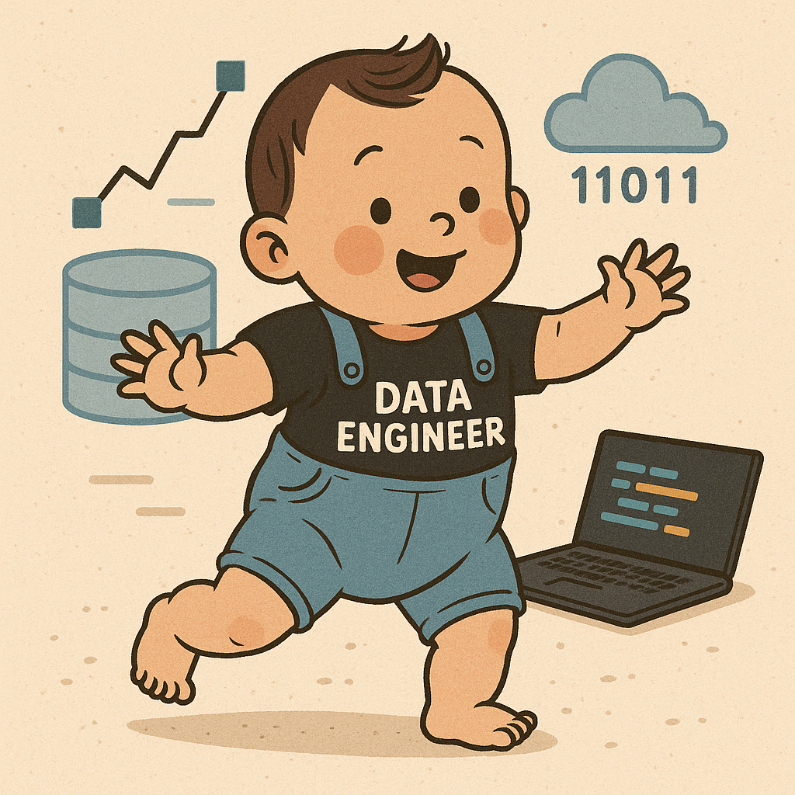

# I AM DATA ENGINEERING TODDLER

> **데이터 엔지니어링 입문부터 실시간 파이프라인 구축까지.**
> 
> 이 프로젝트는 Docker 환경 위에서 **수집(Collect) -> 적재(Ingest) -> 변환(Transform) -> 시각화(Visualize)** 로 이어지는 전체 데이터 파이프라인을 직접 구축해보며 학습한 기록입니다.

<p align="center">
  
</p>

## 🏗️ Project Architecture

이 프로젝트는 로컬 Docker 환경에서 다음 기술 스택들을 유기적으로 연결하여 동작합니다.

| 영역 | 기술 스택 | 역할 |
| :--- | :--- | :--- |
| **Infra** |  | 전체 서비스 컨테이너화 및 오케스트레이션 (Docker Compose) |
| **Orchestration** |  | 데이터 파이프라인 워크플로우 관리 및 스케줄링 |
| **Processing** |  | 대용량 데이터 배치 처리 (PySpark) & 스트리밍 처리 |
| **Streaming** |  | 실시간 데이터 수집 및 메시지 브로킹 |
| **Storage** |  | 데이터 웨어하우스 (DW) 및 메타데이터 저장소 |
| **Transformation** |  | SQL 기반의 데이터 모델링 및 변환 (ELT) |
| **Visualization** |  | 최종 데이터 시각화 및 대시보드 구축 |

## 🚀 Roadmap & Documentation

이 프로젝트는 총 5단계로 진행되었으며, 각 단계별 상세한 구축 과정과 학습 내용은 아래 문서에서 확인할 수 있습니다.

### [Step 1: 환경 구축 (Environment Setup)](./docs/01.%20Docker%2C%20Airflow%2C%20Postgres로%20개발%20환경%20구축하기.md)
- `docker-compose`를 활용하여 Airflow, Postgres 등 기본 인프라 구축
- Airflow 초기 설정 및 DB(Data Warehouse) 생성 스크립트 자동화

### [Step 2: Modern ELT Pipeline](./docs/02.%20Airflow와%20dbt로%20ELT%20파이프라인%20구축하기.md)
- **Extract/Load:** Python(Pandas)을 이용해 CSV 데이터를 Postgres로 적재
- **Transform:** `dbt`를 Airflow와 연동하여 `raw` -> `stg` -> `mart` 레이어로 데이터 변환

### [Step 3: Big Data Batch Processing](./docs/03.%20PySpark를%20활용한%20대용량%20배치%20처리.md)
- **Processing:** Pandas를 **PySpark**로 대체하여 대용량 처리 시뮬레이션
- **Driver/Worker:** Spark Standalone Cluster(Master/Worker) 구축 및 Airflow 연동 (`SparkSubmitOperator`)

### [Step 4: Real-time Streaming](./docs/04.%20Kafka와%20Spark%20Streaming을%20이용한%20실시간%20데이터%20처리.md)
- **Source:** Python 스크립트로 CSV 데이터를 1초 단위로 **Kafka** 토픽에 전송 (Producer)
- **Sink:** **Spark Structured Streaming**을 이용해 Kafka 데이터를 실시간으로 소비(Consumer) 및 집계

### [Step 5: BI & Visualization](./docs/05.%20Metabase를%20활용한%20데이터%20시각화%20(BI)%20구축.md)
- **Metabase**를 도커에 추가하여 Postgres DW와 연동
- `dbt`로 생성된 Mart 데이터를 활용해 환자 방문 현황 시각화 대시보드 구현

## 📂 Directory Structure

```bash
.
├── dags/                   # Airflow DAG 파일
│   ├── elt_patient_pipeline.py
│   └── elt_spark_pipeline.py
├── data/                   # 원본 데이터 (CSV)
│   └── patient_treatment.csv
├── dbt/                    # dbt 프로젝트 (Models, Config)
│   ├── macros/
│   ├── models/
│   │   ├── staging/
│   │   └── marts/
│   ├── dbt_project.yml
│   └── profiles.yml
├── docs/                   # 단계별 상세 학습 문서 (Markdown)
│   ├── 01. Docker, Airflow, Postgres로 개발 환경 구축하기.md
│   ├── 02. Airflow와 dbt로 ELT 파이프라인 구축하기.md
│   ├── 03. PySpark를 활용한 대용량 배치 처리.md
│   ├── 04. Kafka와 Spark Streaming을 이용한 실시간 데이터 처리.md
│   └── 05. Metabase를 활용한 데이터 시각화 (BI) 구축.md
├── img/
├── postgres/               # DB 초기화 스크립트
├── scripts/                # Spark 및 Kafka Python 스크립트
│   ├── kafka_producer.py
│   ├── spark_load_patients.py
│   └── spark_streaming.py
├── docker-compose.yml      # 전체 서비스 정의
└── Dockerfile              # Airflow 커스텀 이미지 (Spark, dbt 라이브러리 포함)
```