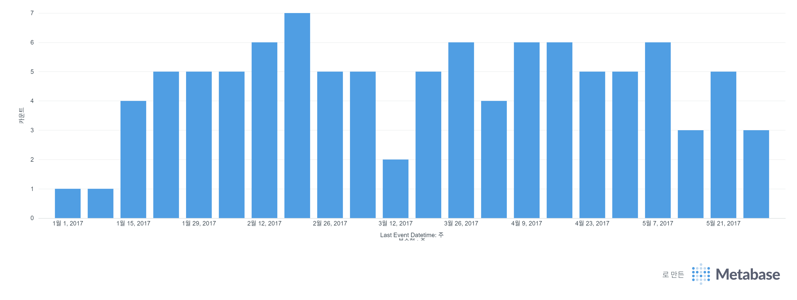

# Step 5: Metabase를 활용한 데이터 시각화 (BI) 구축

## 1\. 학습 목표

  * 앞선 단계(Batch, Streaming, ELT)를 통해 가공된 데이터를 **시각적으로 확인**하여 비즈니스 가치를 증명함.
  * **BI(Business Intelligence) 도구**를 컨테이너 환경에 배포하고 데이터 웨어하우스(Postgres)와 연동함.

## 2\. 도구 선정: Metabase

  * **선정 이유:**
      * **Docker 친화적:** 이미지 하나로 즉시 배포 가능.
      * **직관적인 UI:** SQL을 몰라도 클릭만으로 차트 생성 가능 (No-Code/Low-Code).
      * **PostgreSQL 호환성:** 별도의 드라이버 설치 없이 바로 연결 가능.

## 3\. 환경 구성 (`docker-compose.yml`)

기존 파이프라인에 Metabase 서비스를 추가하여 **분석 환경**을 구축함.

```yaml
  # 9. Metabase (BI Dashboard)
  metabase:
    image: metabase/metabase:latest
    container_name: de_project_metabase
    ports:
      - "3000:3000"  # 브라우저 접근 포트
    environment:
      MB_DB_FILE: /metabase-data/metabase.db # 메타데이터 저장 위치 설정
    volumes:
      # 🌟 [중요] 컨테이너가 재시작되어도 계정/대시보드 정보가 날아가지 않도록 볼륨 마운트
      - metabase_data:/metabase-data
    depends_on:
      - postgres # DB가 켜져야 시각화도 가능하므로 의존성 설정

# 최하단 볼륨 정의
volumes:
  # ...
  metabase_data:
```

## 4\. 데이터베이스 연동 (Connection)

Docker 네트워크 내부 통신을 통해 Metabase 컨테이너가 Postgres 컨테이너에 접속함.

  * **Host:** `de_project_postgres` (Docker Service Name 사용)
      * *Localhost가 아님에 주의.*
  * **Port:** `5432`
  * **Database Name:** `analytics_db` (dbt가 데이터를 생성한 DW)
  * **Username/Password:** `airflow` / `airflow`

## 5\. 시각화 구현 (Dashboarding)

### 5.1 대상 데이터

  * **Schema:** `mart` (dbt가 정제 및 집계한 최종 데이터셋)
  * **Table:** `mart_patient_summary`

### 5.2 시각화 시나리오

dbt가 생성한 데이터를 바탕으로 다음과 같은 인사이트를 도출함.

  * **Raw Data View:** 정제된 환자별 이벤트 로그 확인.
  * **Metrics:**
      * 환자별 총 방문 횟수 (`total_events`) 분포.
      * 시간대별 이벤트 발생 추이.

### 5.3 시각화 예시 (Visualization Example)

다음은 Metabase를 통해 구축한 대시보드의 예시 화면입니다.

